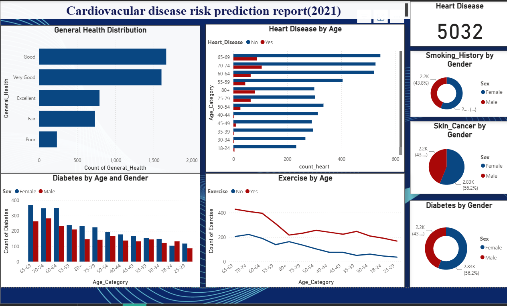

# ❤️ Cardiovascular Disease Data Analysis

Analysis of **5,032 records** (BRFSS and CDC, 2021) to understand how age, gender, lifestyle and health conditions relate to cardiovascular disease, using Python and Power BI.

**Jump to:** [Dashboard](#-dashboard) • [Key Insights](#-key-insights) • [Try It Yourself](#-try-it-yourself) • [Approach](#-approach) • [Tools](#-tools-used) • [Files](#-files)

---

## 📊 Dashboard

---

## 💡 Key Insights

| # | Insight |
|---|---|
| 1 | **Heart disease is concentrated in older age groups.** It is highest in the 65-74 groups, and there are very few cases under 50. |
| 2 | **Most people report good health.** "Good" (about 1,650) and "Very Good" (about 1,600) lead, and "Poor" is the smallest group (about 230). |
| 3 | **Diabetes peaks between ages 60 and 74**, and is higher among females than males in most age groups. |
| 4 | **People who exercise outnumber those who don't in every age group.** |

<b>Findings from the Python analysis (click to expand)</b>

- Individuals reporting **poor or fair general health** showed a higher likelihood of heart disease.
- **Smoking** was associated with a higher likelihood of heart disease and other cancers.
- Alcohol consumption may also contribute to increased health risks.
- Fruit and vegetable consumption showed possible indirect links with heart health when viewed alongside exercise and weight.

---

## 🖱️ Try It Yourself

The dashboard is interactive. After opening it in Power BI Desktop:

1. Click any bar or slice to filter every other chart.
2. Click an age group in **Heart Disease by Age** to see how diabetes and exercise change for that group.
3. Use the **Filters** panel on the right to narrow the data.

**To open it:** download `CVD report.pbix` from this repo and open it in Power BI Desktop.

---

## 🧭 Approach

<b>Data preprocessing</b>

- Loaded the dataset and checked data types and structure
- Checked for null values (none found) and removed duplicates
- Examined outliers using visualizations
- Encoded categorical variables for machine learning

<b>Exploratory data analysis</b>

- **Univariate:** distribution of individual variables
- **Bivariate:** heart disease vs age, fruit consumption vs age, BMI vs age, checkups vs gender
- **Multivariate:** alcohol, fried potato, vegetables, smoking, BMI and heart disease together

<b>Machine learning</b>

- One-hot encoding of categorical features
- Train/test split (80/20)
- Linear Regression, evaluated with R² and Mean Absolute Error

<b>Future scope</b>

- Add blood pressure and cholesterol data
- Handle class imbalance
- Try classification models (Logistic Regression, Random Forest)
- Evaluate with Precision, Recall, F1-Score and ROC-AUC

---

## 🛠️ Tools Used

| Tool | Used for |
|---|---|
| Python (Pandas, NumPy, Matplotlib, Seaborn, Scikit-learn) | Cleaning, EDA and modelling |
| Jupyter Notebook | Analysis environment |
| Power BI | Interactive dashboard |

---

## 📁 Files

| File | Contents |
|---|---|
| `CVD - Python.ipynb` | Python analysis |
| `CVD report.pbix` | Power BI dashboard |
| `CVD presentation.pptx` | Findings presentation |
| `heartdata.csv` | Dataset (5,032 rows, 19 columns) |
| `dashboard-overview.png` | Dashboard screenshot |

---

## 📂 Dataset

BRFSS and CDC (2021), via Kaggle:(https://www.kaggle.com)

---

## 👩‍💻 Author

**Shreya M.S.**
[LinkedIn](paste-your-linkedin-link-here)
